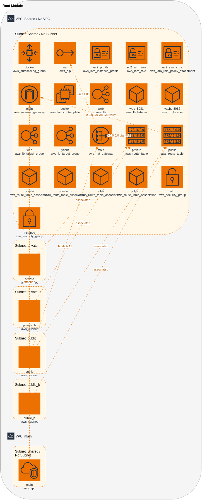

# OpenTofu AWS + EC2 + Nginx + Yacht

This project deploys:
- A VPC with public subnets
- An EC2 instance running Docker
- An Nginx demo container behind an ALB on port `8081`
- A Yacht container behind the same ALB on port `8082`

## Required environment variable

The Yacht admin password is required and is read from OpenTofu variable `yacht_admin_password`.
The Yacht admin email is set in OpenTofu user data as:

`admin@yacht.local`

Use this email with your configured password to log in to Yacht.

This repo provides `.env` with the expected variable name:

```bash
TF_VAR_yacht_admin_password=ReplaceWithAStrongPassword123!
```

Update that value before running `tofu apply`.

## How to set the variable from `.env`

From the project directory:

```bash
set -a
source .env
set +a
```

`set -a` exports variables so OpenTofu can read `TF_VAR_yacht_admin_password`.

## Verify it is set before apply

```bash
printenv TF_VAR_yacht_admin_password
```

You should see your password value (non-empty output).

## Deploy

```bash
tofu init
tofu plan
tofu apply
```

Or use the helper script (recommended):

```bash
./apply.sh
```

`./apply.sh` now runs automatic post-apply checks that:
- Runs `tofu plan -out tfplan` first
- Generates a Draw.io plan diagram from `terraform.tfstate` + plan JSON using `martinf1977/tfstate-drawio:latest`
- Exports diagram artifacts (default: `svg`, `pdf`, and `png`) using `rlespinasse/drawio-desktop-headless:latest`
- Applies the exact saved plan with `tofu apply tfplan`
- Wait for both target groups (`docker-web-tg`, `docker-yacht-tg`) to have healthy targets
- Validate `website_url` and `yacht_url` are returning HTTP success
- If checks fail, pull EC2 diagnostics via SSM (`/var/log/user-data.log`, `docker ps -a`, Docker service status)

Optional toggles:

```bash
# Skip checks once (not recommended for normal deploys)
SKIP_POST_APPLY_CHECK=1 ./apply.sh

# Increase wait timeout to 10 minutes for slow startups
CHECK_TIMEOUT_SECONDS=600 ./apply.sh

# Skip plan diagram generation once
SKIP_PLAN_DIAGRAM=1 ./apply.sh

# Skip diagram exports once
SKIP_PLAN_EXPORT=1 ./apply.sh

# Change diagram output path/name
PLAN_DIAGRAM_OUTPUT=diagrams/my-plan.drawio PLAN_DIAGRAM_NAME="My Plan" ./apply.sh

# Change export formats/output directory
PLAN_EXPORT_FORMATS=svg,pdf,png PLAN_EXPORT_DIR=diagrams ./apply.sh

# Print target-health snapshots during post-check polling
POST_APPLY_VERBOSE=1 ./apply.sh

# Or run checker directly in verbose mode
./post_apply_check.sh --verbose
```

Generate the diagram manually:

```bash
tofu plan -out tfplan
tofu show -json tfplan > tfplan.json
./generate_plan_diagram.sh --input-state terraform.tfstate --plan-json tfplan.json --output diagrams/plan.drawio
./export_diagram_assets.sh --input diagrams/plan.drawio --output-dir diagrams --formats svg,pdf,png
```

## Useful outputs

```bash
tofu output -raw website_url
tofu output -raw yacht_url
```

## Architecture

This stack deploys a small AWS network and application platform for two Docker-backed services.

- A VPC contains two public subnets and two private subnets across `eu-west-1a` and `eu-west-1b`
- An internet-facing Application Load Balancer lives in the public subnets and exposes:
	- `8081` for the Nginx demo container
	- `8082` for the Yacht container
- An Auto Scaling Group launches EC2 instances into the private subnets from a launch template
- The EC2 instances use a NAT gateway for outbound internet access so they can install Docker and pull container images during bootstrap
- Docker runs both application containers on each instance:
	- Nginx on port `80`
	- Yacht on port `8000`
- Target groups route ALB traffic to the EC2 instances and health checks decide whether traffic should be forwarded
- SSM is enabled on the instances for remote diagnostics without requiring SSH access

Current generated architecture diagram:

[Open the editable Draw.io source](diagrams/plan.drawio)


